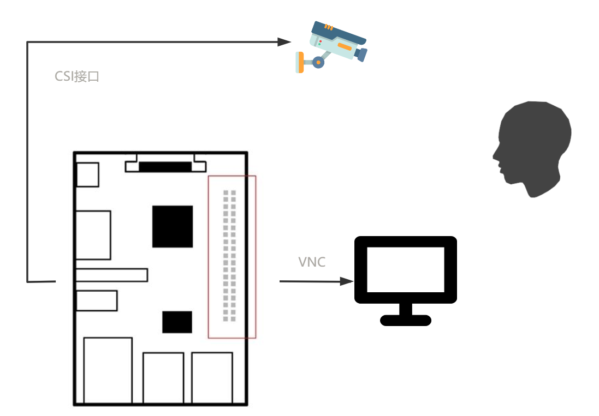

# 基于树莓派3b的人脸的动态检测定位
## Outline
- Introduction
  - The general description of your idea/other people's ideas
  - The highlights of your program
    - Hardware
    - Software
- Platform (This part aims to introduce what you have (e.g. PC, Respi, etc.))
  - Hardware (Fig.1 The real part of your RasPi)
  - Software (Fig.2 xxx)
- Implementation
  - The whole system (Fig.3 Flowchart of your entire structure of program)
  - Hardware (Describe the main steps for hardware)
  - Software (Demonstrate the steps of face recognition)
- Test
  - Initial test
  - Adjustment
- Reference
  - Hardware
  - Software

1. 实现图片的人脸检测、定位、识别
2. 动态实现
3. 性能优化
## 第一部分
### 硬件连接  
树莓派作为图像处理平台  
用另一台电脑通过VNC连接树莓派作为显示屏  

### 软件实现  
摄像头采集图片 --> 预处理 --> 人脸特征探测 --> 轮廓特征提取 --> 特征值比较

## Reference
### Hardware
- [树莓派实验室](https://shumeipai.nxez.com)
- [Raspberry Pi 3 Model B+](https://www.raspberrypi.org/products/raspberry-pi-3-model-b-plus/)

### Software
