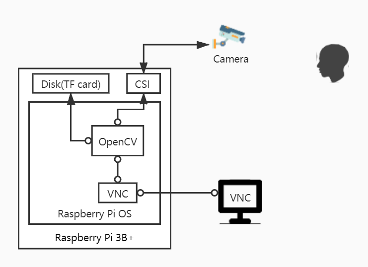

# 基于树莓派3b+的人脸的动态检测定位
## Outline
- **Introduction**
  - The general description of the ideas
  - The highlights of this program
- **Platform** 
  - Hardware 
  - Software
- **Implementation**
  - The whole system
  - Hardware (Describe the main steps for hardware)
  - Software (Demonstrate the steps of face recognition)
- **Test**
  - Initial test
  - Adjustment
- **Reference**
  - Hardware
  - Software

## Introduction
- The general description of the ideas
1. 实现图片的人脸检测、定位、识别
2. 动态实现
3. 性能优化
- The highlights of this program
1. 算力足够---对于嵌入式系统而言（Broadcom BCM2837B0----1.4GHz 64-bit quad-core ARMv8 Cortex-A53）
2. 结构简单、易实现----适用于初学图像处理相关知识
3. 成本低----用现有硬件
## Platform
### Hardware
1. [树莓派3B+](https://www.raspberrypi.org/products/raspberry-pi-3-model-b-plus/)
   - CSI（Camera Serial Interface）接口，CSI接口是MIPI联盟规范的接口之一，其物理层实现有MIPI D-PHY和MIPI C-PHY。CSI接口具有高性能、低功耗、低电磁干扰的特点，广泛用于移动设备和车载应用。
   - TF卡，插入卡槽作为硬盘使用。
2. 500万像素的树莓派摄像头(OV5647)
   - 与树莓派通过FFC（Flexible Flat Cable）线相连。FFC线即软排线，可以任意选择导线数目与间距，适合PCB与PCB之间、移动部件与主板之间的连接。
### Software
1. [Raspberry Pi OS with desktop](https://www.raspberrypi.org/software/operating-systems/#raspberry-pi-os-32-bit)
	- Release date: December 2nd 2020
	- Kernel version: 5.4
	- Size: 1,177MB
2. Python
   - OpenCV Package
3. VNC server
   - Provide virtual desktop to the controller when it's headless(i.e. not plugged into a monitor)
## Implementation
### The whole system

* 考虑到USB摄像头会在速度上有一定的降低，摄像头通过CSI接口与树莓派3B+相连。
* TF卡是系统的硬盘。
* OpenCV通过CSI接口控制摄像头，获取数据后可存储至TF卡或进行处理、处理后通过VNC(服务端)发送至局域网内的VNC(客户端)。

摄像头模块受Python程序调用的OpenCV库的控制，对用户进行拍照或摄像。该结果被存储在TF卡中，或者被处理之后再存储。图像的处理是在图像的获取之后进行的，对图像进行的处理可以是人脸的检测、定位、识别，处理后的结果通过VNCserver程序显示在另一台电脑，这样树莓派就可以不必连接显示器。

## Reference
### Hardware
- [树莓派实验室](https://shumeipai.nxez.com)
- [Raspberry Pi 3 Model B+](https://www.raspberrypi.org/products/raspberry-pi-3-model-b-plus/)

### Software
